<!-- Actual text starts here -->
## Probability Practice

### Part A.

Visitors to your website are asked to answer a single survey question
before they get access to the content on the page. Among all of the
users, there are two categories: Random Clicker (RC), and Truthful
Clicker (TC). There are two possible answers to the survey: yes and no.
Random clickers would click either one with equal probability. You are
also giving the information that the expected fraction of random
clickers is 0.3. After a trial period, you get the following survey
results: 65% said Yes and 35% said No.  What fraction of people who are
truthful clickers answered yes? Hint: use the rule of total probability.

#### Answer:

Let us list down all the listed porbabilities to get started with the
formulation of the problem

-   Total probability of an yes *P*(*Y*) = 0.65
-   Probability of an yes given the click is by a random clicker
    *P*(*Y*/*R**C*) = 0.5
-   Probability of a clicker being a random clicker *P*(*R**C*) = 0.3
-   Probability of a clicker being a truthful clicker *P*(*T**C*) = 0.7

Let’s consider the total probability equation of yes to get started
with: Total probability *P*(*Y*) =  
Joint probability of Yes and Random Clickers *P*(*Y*,*R**C*) + Joint
probability of Yes and True Clickers *P*(*Y*,*T**C*)  
i.e *P*(*Y*) = *P*(*Y*,*R**C*) + *P*(*Y*,*T**C*)  
=\>
*P*(*Y*) = *P*(*Y*/*R**C*) \* *P*(*R**C*) + *P*(*Y*/*T**C*) \* *P*(*T**C*)  
=\>
*P*(*Y*/*T**C*) \* *P*(*T**C*) = *P*(*Y*) − *P*(*Y*/*R**C*) \* *P*(*R**C*)  
=\>
*P*(*Y*/*T**C*) = (*P*(*Y*)−*P*(*Y*/*R**C*)\**P*(*R**C*))/*P*(*T**C*)  
Substituting the given values  
$P(Y/TC) = (0.65 - (0.5\*0.3))/0.7

**Another easier way would be to assume the number of participants in
the survey to be 100 and assuming ‘p’ proportion of TCs say yes**

=\> *P*(*R**C*) = 30 =\> *P*(*T**C*) = 70 =\> *P*(*Y*/*T**C*) = (70 \*
p)  
=\> *P*(*N*/*T**C*) = (70 *(1-p)) =\> *P*(*T*/*R**C*) = (30*0.5) =\>
*P*(*N*/*R**C*) = (30\*0.5)

Which means that out of the random callers, 15 would say ‘Yes’, 15 would
say ‘No’. We need to evaluate how many of the True Clickers said ‘Yes’.

Basically the total number of people who said yes is - 15 + (70\*p) out
of a total of 100 people

(15 + (70 \*p)=65

p=5/7

**Fraction of people who are truthful clickers answered yes = 5/7**

### Part B.

Imagine a medical test for a disease with the following two attributes:

-   The sensitivity is about 0.993. That is, if someone has the disease,
    there is a probability of 0.993 that they will test positive.

-   The specificity is about 0.9999. This means that if someone doesn’t
    have the disease, there is probability of 0.9999 that they will test
    negative.

-   In the general population, incidence of the disease is reasonably
    rare: about 0.0025% of all people have it (or 0.000025 as a decimal
    probability).

Suppose someone tests positive. What is the probability that they have
the disease?

#### Answer:

Let’s assume a population of 1 billion to continue with the problem

-   Probability of positive test result given the presence of disease
    *P*(*P*/*D*) = 0.993
-   Probability of negative result given there is no disease
    *P*(*N*/*N**o**D**i**s*) = 0.9999
-   Total probability of having a disease *P*(*D*) = 0.000025

The following confusion matrix is used for calculating the TP,TN,FP and
FN

| Confusion matrix |         |             |     |
|------------------|---------|-------------|-----|
| Test Result      | Disease | No Disease  |     |
| Positive         | 24,825  | 99,997      |     |
| Negative         | 175     | 999,875,003 |     |

-   Using the above calculations, we can see that there is a *0.1988*
    probability of having a disease if the test result is positive

## Wrangling the Billboard Top 100

### Part A

Make a table of the top 10 most popular songs since 1958, as measured by
the total number of weeks that a song spent on the Billboard Top 100.
Note that these data end in week 22 of 2021, so the most popular songs
of 2021 will not have up-to-the-minute data; please send our apologies
to The Weeknd.

Your table should have 10 rows and 3 columns: performer, song, and
count, where count represents the number of weeks that song appeared in
the Billboard Top 100. Make sure the entries are sorted in descending
order of the count variable, so that the more popular songs appear at
the top of the table. Give your table a short caption describing what is
shown in the table.

(Note: you’ll want to use both performer and song in any group_by
operations, to account for the fact that multiple unique songs can share
the same title.)

    ## `summarise()` has grouped output by 'performer'. You can override using the
    ## `.groups` argument.

| Performers                                | Songs                               | Total Weeks on Billboard |
|:----------------------------|:------------------------|-----------------:|
| Imagine Dragons                           | Radioactive                         |                       87 |
| AWOLNATION                                | Sail                                |                       79 |
| Jason Mraz                                | I’m Yours                           |                       76 |
| The Weeknd                                | Blinding Lights                     |                       76 |
| LeAnn Rimes                               | How Do I Live                       |                       69 |
| LMFAO Featuring Lauren Bennett & GoonRock | Party Rock Anthem                   |                       68 |
| OneRepublic                               | Counting Stars                      |                       68 |
| Adele                                     | Rolling In The Deep                 |                       65 |
| Jewel                                     | Foolish Games/You Were Meant For Me |                       65 |
| Carrie Underwood                          | Before He Cheats                    |                       64 |

### Part B

Is the “musical diversity” of the Billboard Top 100 changing over time?
Let’s find out. We’ll measure the musical diversity of given year as the
number of unique songs that appeared in the Billboard Top 100 that year.
Make a line graph that plots this measure of musical diversity over the
years. The x axis should show the year, while the y axis should show the
number of unique songs appearing at any position on the Billboard Top
100 chart in any week that year. For this part, please filter the data
set so that it excludes the years 1958 and 2021, since we do not have
complete data on either of those years. Give the figure an informative
caption in which you explain what is shown in the figure and comment on
any interesting trends you see.

There are number of ways to accomplish the data wrangling here. We offer
you two hints on two possibilities:

You could use two distinct sets of data-wrangling steps. The first set
of steps would get you a table that counts the number of times that a
given song appears on the Top 100 in a given year. The second set of
steps operate on the result of the first set of steps; it would count
the number of unique songs that appeared on the Top 100 in each year,
irrespective of how many times it had appeared. You could use a single
set of data-wrangling steps that combines the length and unique
commands.

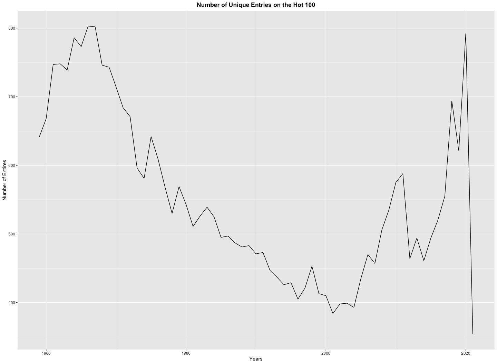

*The number of Hot 100 Entries from 1958 through 2021 is depicted in
this graph. It’s interesting to observe the gradual drop in music
diversity from 1970 to an all-time low in the early 2000s, and we can
clearly see how iTunes and streaming began to have an impact starting
around 2005. Maybe a consolidation of genres in the zeitgeist might be
blamed for the reduction of musical diversity in the 20th century.*

### Part C

Let’s define a “ten-week hit” as a single song that appeared on the
Billboard Top 100 for at least ten weeks. There are 19 artists in U.S.
musical history since 1958 who have had at least 30 songs that were
“ten-week hits.” Make a bar plot for these 19 artists, showing how many
ten-week hits each one had in their musical career. Give the plot an
informative caption in which you explain what is shown.

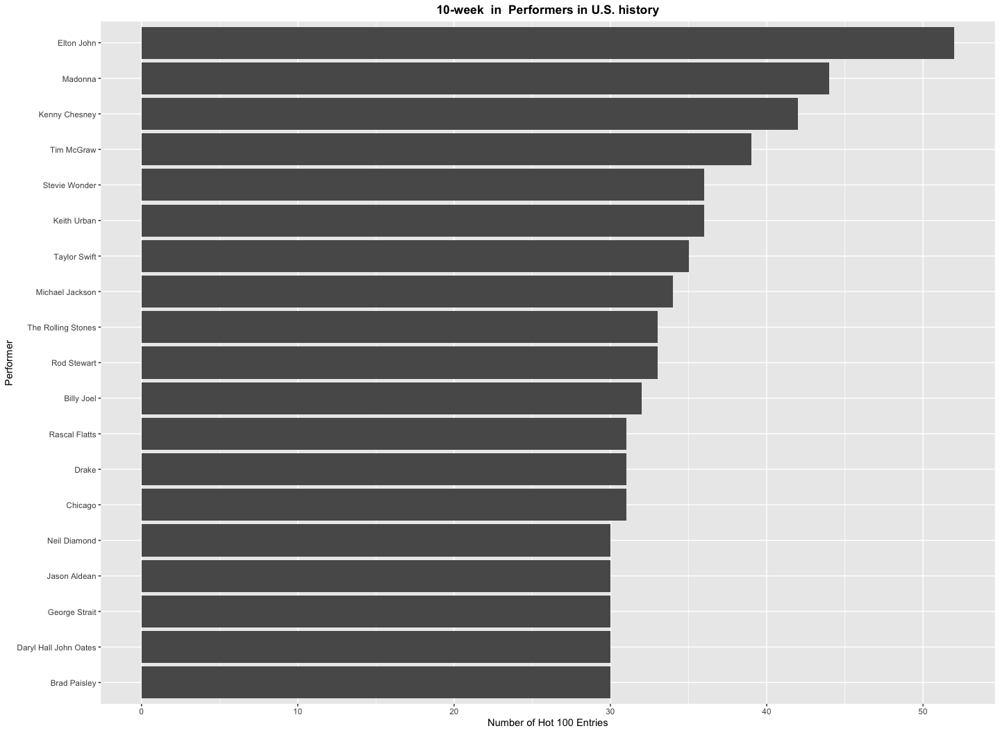

## Visual story telling part 1: green buildings

The EDA has been carried out in multiple phases to arrive at a final
conclusion about building a Green building or Non-green buildings

-   Step 1: Perform exploratory data analysis on **all buildings** in
    the dataset to find any insights at a macro level

-   Step 2: Perform EDA by **splitting the buildings in to Green and
    Non-Green**

-   Step 3: Perform EDA by considering **local markets(clusters)** and
    derive insights

Importing the data and all the required libraries

#### Step 1: Analysis on all buildings

1.Obtain a brief idea about the columns in the dataset

    ## 'data.frame':    7894 obs. of  23 variables:
    ##  $ CS_PropertyID    : int  379105 122151 379839 94614 379285 94765 236739 234578 42087 233989 ...
    ##  $ cluster          : int  1 1 1 1 1 1 6 6 6 6 ...
    ##  $ size             : int  260300 67861 164848 93372 174307 231633 210038 225895 912011 518578 ...
    ##  $ empl_gr          : num  2.22 2.22 2.22 2.22 2.22 2.22 4.01 4.01 4.01 4.01 ...
    ##  $ Rent             : num  38.6 28.6 33.3 35 40.7 ...
    ##  $ leasing_rate     : num  91.4 87.1 88.9 97 96.6 ...
    ##  $ stories          : int  14 5 13 13 16 14 11 15 31 21 ...
    ##  $ age              : int  16 27 36 46 5 20 38 24 34 36 ...
    ##  $ renovated        : int  0 0 1 1 0 0 0 0 0 1 ...
    ##  $ class_a          : int  1 0 0 0 1 1 0 1 1 1 ...
    ##  $ class_b          : int  0 1 1 1 0 0 1 0 0 0 ...
    ##  $ LEED             : int  0 0 0 0 0 0 0 0 0 0 ...
    ##  $ Energystar       : int  1 0 0 0 0 0 1 0 0 0 ...
    ##  $ green_rating     : int  1 0 0 0 0 0 1 0 0 0 ...
    ##  $ net              : int  0 0 0 0 0 0 0 0 0 0 ...
    ##  $ amenities        : int  1 1 1 0 1 1 1 1 1 1 ...
    ##  $ cd_total_07      : int  4988 4988 4988 4988 4988 4988 2746 2746 2746 2746 ...
    ##  $ hd_total07       : int  58 58 58 58 58 58 1670 1670 1670 1670 ...
    ##  $ total_dd_07      : int  5046 5046 5046 5046 5046 5046 4416 4416 4416 4416 ...
    ##  $ Precipitation    : num  42.6 42.6 42.6 42.6 42.6 ...
    ##  $ Gas_Costs        : num  0.0137 0.0137 0.0137 0.0137 0.0137 ...
    ##  $ Electricity_Costs: num  0.029 0.029 0.029 0.029 0.029 ...
    ##  $ cluster_rent     : num  36.8 36.8 36.8 36.8 36.8 ...

    ## [1] "Median rent of green buildings :  27.6"

    ## [1] "Median rent of green buildings :  25"


    ## [1] "Median leasing rate of green buildings :  92.92"

    ## [1] "Median leasing rate of non green buildings :  89.17"

-   Green buildings have a higher occupancy rate when compared to
    non-green buildings  
-   As the stats guru, pointed out the median of green buildings($27.6)
    is higher than the median of non-green buildings($25). But he did
    not consider the effect of confouding variables while performing the
    analysis. In teh next section, we will check or the influence of
    confounding vairables on the Rent of green and non-green buildings

1.  We will create some hypotheses using which we will steer through the
    data to understand if the data agrees with the respective
    hypotheses  
    a.Less leasing_rate might be a proxy for less demand for commercial
    real-estate  
    b.Rent decreases with age for buildings  
    c.Renovated buildings with age \>30 years get higher rent than
    buidings with age \< 30 without renovation  
    d.Buidings with amenities have higher rents than the other buildings
    e.class_a buildings have higher rent than the other buildings

Let’s plot the respective distribution to find if the hypotheses can be
supported using the relationships

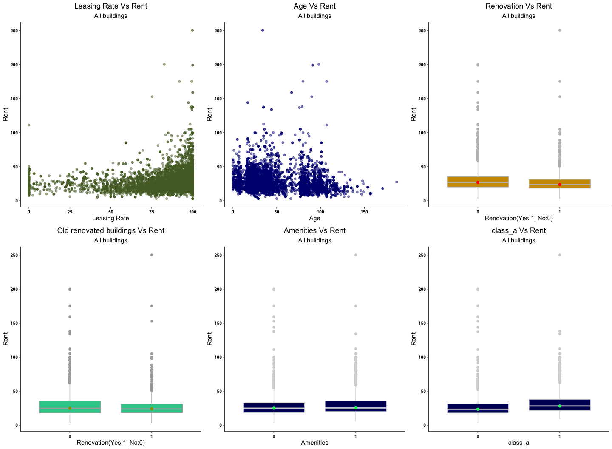

**Findings**:

-   Age has no visible relation with Rent when all buildings are
    considered

-   Buildings with Amenities and class_a quality material have slightly
    higher rent than the other buildings

#### Step 2: Comparison of different variables for Green and Non-Green buildings

Lets check the above hypotheses for Green and Non-Green buildings
separtely to see if there is any influence

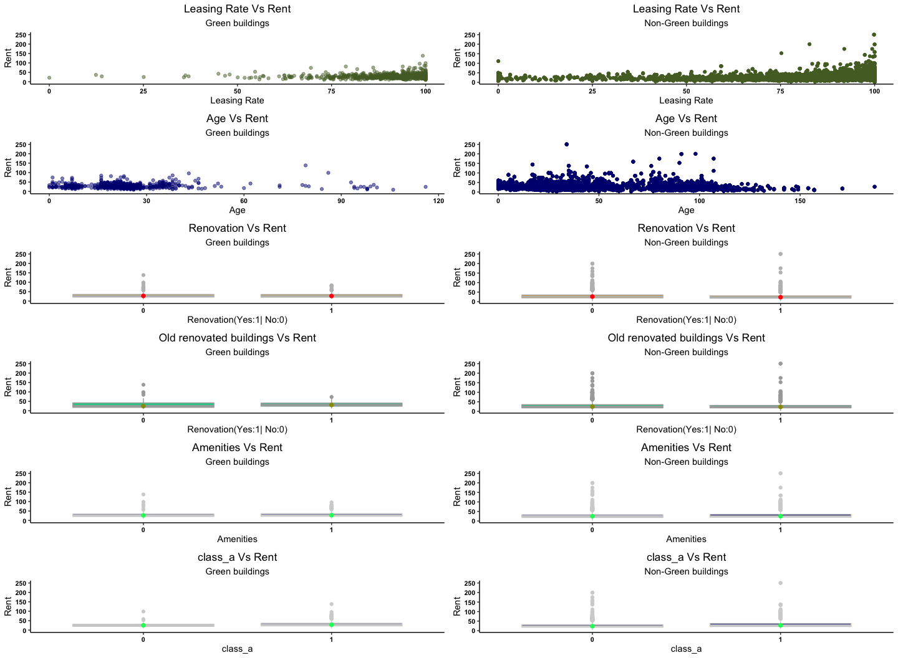
**Findings**:

-   Older Green Buildings have the possibility of charging higher rents
    when they are renovated

-   There are no variables that affect the distribution of rent even
    after the buildings are split into green and non-green buildings

#### Step 3: Deep Diving into some of the potential variables to see the difference between rents between green and non-green buildings


    ## [1] "Median rent of green buildings less than 30 years of age: 28"

    ## [1] "Median rent of non - green buildings less than 30 years of age: 27"

**Findings:**  
\* Age of the building does not affect the rent of the buildings as the
green buildings have consistently higher rents across ages

-   After exploring multiple variables, it is clear that there is no one
    variable that affects the rent and clearly people are willing to pay
    more rent based on the green perception of the building although
    there is no way to quantify that experience

#### Step 4: As it is evident that people are willing to pay more for the green buildings,lets come up with an estimate for the returns on building a green building

1.Lets consider a local market(cluster) to check the probability of
receiving a particular amount of rent  
\* Let us check the distribution of cluster rents to understand the
local markets  
\* You can observe that more than 50% of the markets have rent less than
$25 rent  
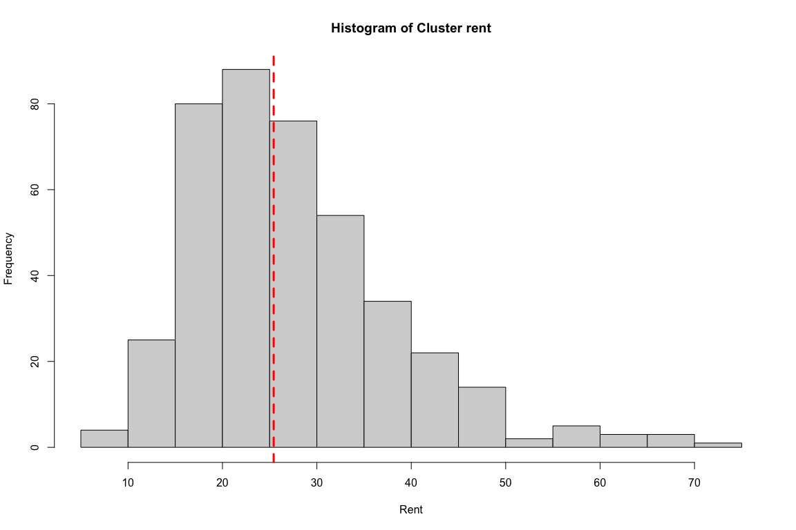
**We can further calculate the number of local markets in which the rent
for green building is higher than the median cluster rent as median is
more robust to outliers**

-   Green buildings have higher rents than the median rents in more than
    75% of the local markets and on an averge it is $4.89  
-   In about 25% of the local markets, green buildings have lesser rent
    than the median rents and the value is $3 on an average  
-   With these observations,we can conclude that there is more than 75%
    chance that you will earn higher rents than the average in the local
    markets with a value more than $4.89

2.Estimate for calculating the returns on building a green building  
\* If we consider the mean of the differences between green buildings
and the median local market rents, we see that green buildings get \~$3
more than the non-green builings

*Adjusting the estimates of the stats guru, by 0.4 , we can see that an
extra $750,000 revenue can be earned by building a green building.*

*Based on the extra revenue, we can recuperate the costs in 6.66 years
and even with 90% occupancy as is evident from data, the builder can
start earning profits after 7.4 years*

## Visual story telling part 2: Capital Metro data

    ##   timestamp    boarding   alighting day_of_week temperature hour_of_day 
    ##           0           0           0           0           0           0 
    ##       month     weekend 
    ##           0           0

    ##              timestamp boarding alighting day_of_week temperature hour_of_day
    ## 1  2018-09-01 06:00:00        0         1         Sat       74.82           6
    ## 2  2018-09-01 06:15:00        2         1         Sat       74.82           6
    ## 3  2018-09-01 06:30:00        3         4         Sat       74.82           6
    ## 4  2018-09-01 06:45:00        3         4         Sat       74.82           6
    ## 5  2018-09-01 07:00:00        2         4         Sat       74.39           7
    ## 6  2018-09-01 07:15:00        4         4         Sat       74.39           7
    ## 7  2018-09-01 07:30:00        3        12         Sat       74.39           7
    ## 8  2018-09-01 07:45:00        8         4         Sat       74.39           7
    ## 9  2018-09-01 08:00:00        4        15         Sat       75.72           8
    ## 10 2018-09-01 08:15:00        7        10         Sat       75.72           8
    ##    month weekend net_outflow
    ## 1    Sep weekend          -1
    ## 2    Sep weekend           1
    ## 3    Sep weekend          -1
    ## 4    Sep weekend          -1
    ## 5    Sep weekend          -2
    ## 6    Sep weekend           0
    ## 7    Sep weekend          -9
    ## 8    Sep weekend           4
    ## 9    Sep weekend         -11
    ## 10   Sep weekend          -3

    ## [1] "timestamp"   "boarding"    "alighting"   "day_of_week" "temperature"
    ## [6] "hour_of_day" "month"       "weekend"     "net_outflow"

    ## [1] 5824    9

#### Volume of Boardings by month


#### Volume of Alightings by month


#### Volume of Boardings by day_of_week

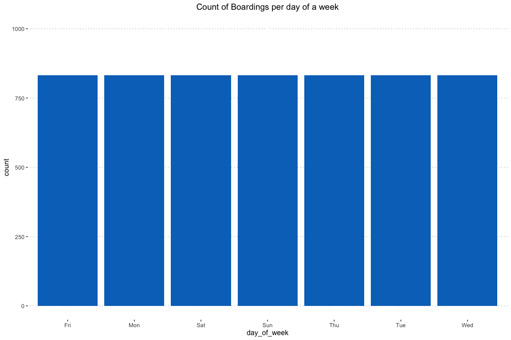

#### Correlation between boarding and alighting

    ## [1] 0.120225

#### Analysis

#### Comparison of mean boardings and mean alightings by month with difference of alighting and boarding included

    ## `summarise()` has grouped output by 'month'. You can override using the
    ## `.groups` argument.


Average number of boardings and alightings are plotted and compared for
all 3 months. Mean number of boardings and alightings seem to be higher
for October month followed by September and November, the reason being
UT students will start coming to classes in September and it takes time
for them to get to know about Metro , peak goes up in October and
finally intensity of boardings and alightings comes down in November
because of thanksgiving

#### Comparison of mean boardings and mean alightings by month for each day of a week

    ## `summarise()` has grouped output by 'month'. You can override using the
    ## `.groups` argument.

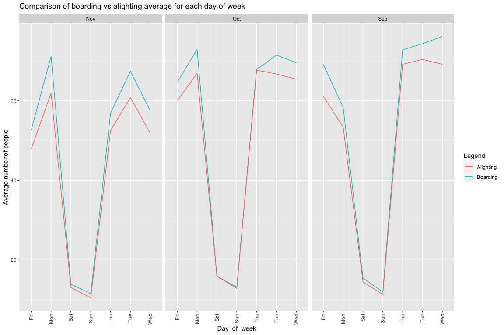

The pattern of average number of people boarding and alighting for each
day of a week is same for all the months and it is observed for weekends
that the intensity of boardings and alightings is less when compared to
week days as the students will not be coming to university

#### Comparison of mean boardings and mean alightings by month with temperature included

    ## `summarise()` has grouped output by 'month'. You can override using the
    ## `.groups` argument.

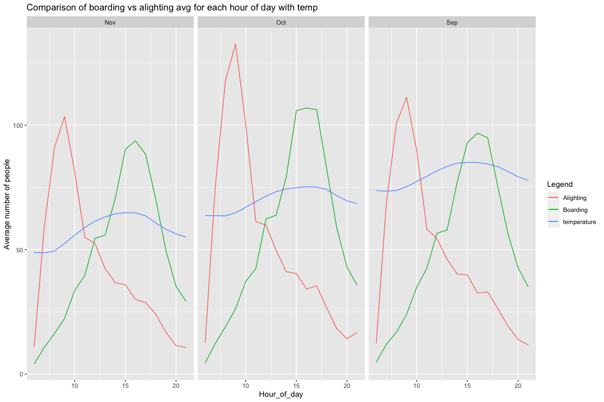

Average boardings and Average alightings are plotted for each month with
temperature included and it is noticed that temperature is not impacting
the boardings and alightings

## Portfolio Modelling

**I chose the following ETF’s trying to diversiy my portfolio :**

-   SPY- SPDR S&P 500 ETF Trust, SPY is one of the largest and most
    heavily-traded ETFs in the world, offering exposure to one of the
    most well known equity benchmarks. While SPY certainly may have
    appeal to investors seeking to build a long-term portfolio and
    include large cap U.S. stocks, this fund has become extremely
    popular with more active traders as a way to toggle between risky
    and safe assets.

-   TLT - iShares 20+ Year Treasury Bond ETF , This ETF is one of the
    most popular options for investors seeking to establish exposure to
    long-dated Treasuries, an asset class that is light on credit risk
    but may offer attractive yields thanks to an extended duration and
    therefore material interest rate risk.

-   LQD - iShares iBoxx $ Investment Grade Corporate Bond ETF,This ETF
    is the most popular option for investors looking to gain exposure to
    investment grade corporate bonds, making it a useful tool for those
    looking to access a corner of the bond market that should be a core
    component of any long-term, buy-and-hold portfolio. LQD is probably
    of limited use for short term traders, who will prefer to utilize
    more extreme ends of the risk spectrum to capitalize off of short
    term movements in asset prices and risk tolerance.

-   EEM- iShares MSCI Emerging Markets ETF, EEM is one of the most
    popular ETFs in the world, and is one of the oldest products on the
    market offering exposure to stock markets of emerging economies.

-   VNQ-Vanguard Real Estate ETF,The Vanguard Real Estate Trust (VNQ)
    offers broad exposure to U.S. equity REITs, alongside a small
    allocation to specialized REITs and real estate firms.

<!-- -->

    ## [1] "SPY" "TLT" "LQD" "EEM" "VNQ"

    ##    ClCl.SPYa            ClCl.TLTa            ClCl.LQDa         
    ##  Min.   :-0.1094237   Min.   :-6.668e-02   Min.   :-5.003e-02  
    ##  1st Qu.:-0.0033220   1st Qu.:-5.051e-03   1st Qu.:-1.977e-03  
    ##  Median : 0.0007051   Median : 2.716e-04   Median : 4.170e-04  
    ##  Mean   : 0.0005856   Mean   : 5.250e-06   Mean   : 8.494e-05  
    ##  3rd Qu.: 0.0059251   3rd Qu.: 5.148e-03   3rd Qu.: 2.407e-03  
    ##  Max.   : 0.0906033   Max.   : 7.520e-02   Max.   : 7.392e-02  
    ##    ClCl.EEMa            ClCl.VNQa         
    ##  Min.   :-0.1247925   Min.   :-0.1772774  
    ##  1st Qu.:-0.0067539   1st Qu.:-0.0052663  
    ##  Median : 0.0010023   Median : 0.0009266  
    ##  Mean   : 0.0002299   Mean   : 0.0003324  
    ##  3rd Qu.: 0.0076026   3rd Qu.: 0.0067994  
    ##  Max.   : 0.0805289   Max.   : 0.0899666

The prices are daily starting from 3rd January 2007. To get an idea of
the kind of returns that they have provided, let’s calculate the percent
changes between two closing prices of each of these assets.

Based on the summary statistics of the stocks, we can infer that
SPY,TLT,LQD are in the safe category as their returns are in a
resaonable range.

-   TLT with +75% and -66%
-   LQD with +-9%
-   SPY with +14% and -10%

*During all the strategies, i have considered 8000 bootstrap samples
from the past and plotted the 20 day returns for all the 3 strategies
below*

### Strategy one - Even split of my assets

An even split of my assets would be 20% across all the ETF’s.Here, we
assume that we re-distribute the total capital at the end of each day
equally amongst the five ETFs.

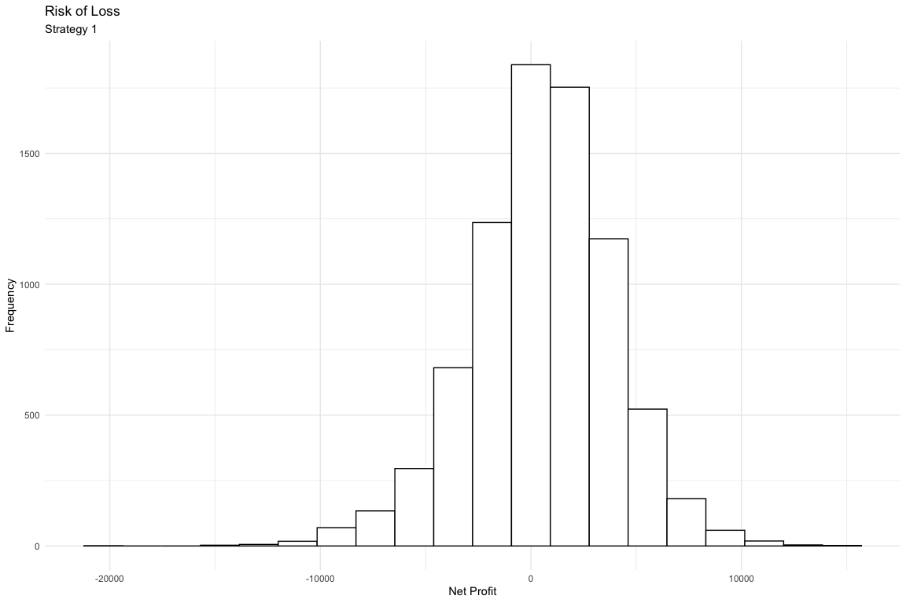

The above histogram shows the difference between final amount at the end
of 20 days and the initial wealth invested. Negtives indicate losses and
positive means profits. The value at risk at the 5% level is $
-5143.4401574

### Strategy two - Safer than even split

We notice that *SPY*, *TLT* and *LQD* are the safe bets in the summary
stats.

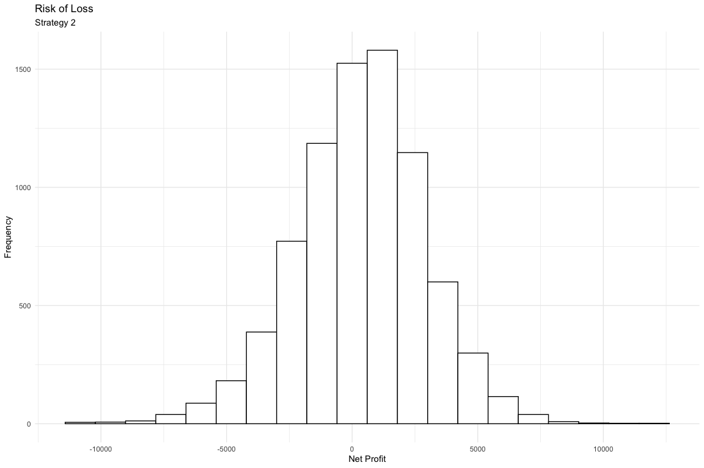

The above histogram shows the difference between final amount at the end
of 20 days and the initial wealth invested. Negtives mean losses and
positive means profits. The value at risk at the 5% level is $
-3874.0235023

### Strategy three - Aggressive strategy

Similarly, we notice that *VNQ* and *EEM* are the riskier portfolios due
to their volatile nature. Since we are going with aggressive strategy we
invest more in EEMs due to the possibility of a very large return on my
investment.


The above histogram shows the difference between final amount at the end
of 20 days and the initial wealth invested. Negtives mean losses and
positive means profits. The value at risk at the 5% level is $
-8471.6277494

### Results

Looking at the bootstrap resamples and the related value at risk at 5%,
we see that -

*1. Strategy one - Even split of my assets - has a value at risk at 5%
of $-5143.4401574. We would end up with around USD 1.0053611^{5} on
average with a possibility to even reach USD 1.1545639^{5}*

*2. Strategy two - Safer than even split - has a value at risk at 5% of
$-3874.0235023. The strategy to play safer shows in the results. On
average we end up with around USD 1.0034094^{5} and the max we can
possibly make is USD 1.1179693^{5}.*

*3. Strategy three - Aggressive strategy- has a value at risk at 5% of
$-8471.6277494. There is a super high risk with this investment.
Although the average is still around USD 1.0061984^{5}, we can possible
more than double our money and end up with USD 1.278865^{5} or lose a
lot and end up with just USD 6.9156711^{4}.*

## Clustering and PCA

### K-Means

-   After scaling the data, I used the k-means clustering algorithm. I
    selected k = 2 because there were two types of wine, red and white,
    each having 25 starters. I compare the averages of chemical
    attributes for white wine and red wine in our original data with
    those of the clustered data to check if the k-means has clustered
    data points by wine color into red and white wine.

<!-- -->

    ## # A tibble: 2 × 13
    ##   color fixed.acidity volatile.acidity citric.acid residual.sugar chlorides
    ##   <chr>         <dbl>            <dbl>       <dbl>          <dbl>     <dbl>
    ## 1 red            8.32            0.528       0.271           2.54    0.0875
    ## 2 white          6.85            0.278       0.334           6.39    0.0458
    ##   free.sulfur.dioxide total.sulfur.dioxide density    pH sulphates alcohol
    ##                 <dbl>                <dbl>   <dbl> <dbl>     <dbl>   <dbl>
    ## 1                15.9                 46.5   0.997  3.31     0.658    10.4
    ## 2                35.3                138.    0.994  3.19     0.490    10.5
    ##   quality
    ##     <dbl>
    ## 1    5.64
    ## 2    5.88

    ##        fixed.acidity     volatile.acidity          citric.acid 
    ##            8.2895922            0.5319416            0.2695435 
    ##       residual.sugar            chlorides  free.sulfur.dioxide 
    ##            2.6342666            0.0883238           15.7647596 
    ## total.sulfur.dioxide              density                   pH 
    ##           48.6396835            0.9967404            3.3097200 
    ##            sulphates              alcohol 
    ##            0.6567194           10.4015216

    ##        fixed.acidity     volatile.acidity          citric.acid 
    ##           6.85167903           0.27458385           0.33524928 
    ##       residual.sugar            chlorides  free.sulfur.dioxide 
    ##           6.39402555           0.04510424          35.52152864 
    ## total.sulfur.dioxide              density                   pH 
    ##         138.45848785           0.99400486           3.18762464 
    ##            sulphates              alcohol 
    ##           0.48880511          10.52235888

#### Inference :

-   When we compare the averages of red and white wine chemical
    characteristics in our original data to the averages of red and
    white wine chemical properties in clustered data, we can see that
    the averages of chemical properties for red wine in both original
    and k-means clustered data are nearly the same. Similarly, the
    averages of chemical attributes for white wine are nearly identical
    in both the original and clustered data. This suggests that k-means
    is easily capable of differentiating between red and white wines.

-   To further validate this, I created a confusion matrix. In the
    table, we can observe that k-means grouped data fairly accurately by
    wine color. With a precision of 98.5 percent, we may infer that
    k-means clustering performed admirably in terms of dimension
    reduction.

<!-- -->

    ##        cluster
    ## color    red white
    ##   red   1575    24
    ##   white   68  4830

    ## [1] 0.9858396

### PCA

-   Following k-means clustering technique, I performed Principal
    Component Analysis (PCA). The first three principal components
    account for 64.3 percent of the total variation in the data set, as
    seen in the table below. As a result, I clustered using the first
    three components.

<!-- -->

    ## Importance of components:
    ##                           PC1    PC2    PC3     PC4     PC5     PC6     PC7
    ## Standard deviation     1.7407 1.5792 1.2475 0.98517 0.84845 0.77930 0.72330
    ## Proportion of Variance 0.2754 0.2267 0.1415 0.08823 0.06544 0.05521 0.04756
    ## Cumulative Proportion  0.2754 0.5021 0.6436 0.73187 0.79732 0.85253 0.90009
    ##                            PC8     PC9   PC10    PC11
    ## Standard deviation     0.70817 0.58054 0.4772 0.18119
    ## Proportion of Variance 0.04559 0.03064 0.0207 0.00298
    ## Cumulative Proportion  0.94568 0.97632 0.9970 1.00000

    ##                         PC1    PC2    PC3
    ## fixed.acidity        -0.239  0.336 -0.434
    ## volatile.acidity     -0.381  0.118  0.307
    ## citric.acid           0.152  0.183 -0.591
    ## residual.sugar        0.346  0.330  0.165
    ## chlorides            -0.290  0.315  0.017
    ## free.sulfur.dioxide   0.431  0.072  0.134
    ## total.sulfur.dioxide  0.487  0.087  0.107
    ## density              -0.045  0.584  0.176
    ## pH                   -0.219 -0.156  0.455
    ## sulphates            -0.294  0.192 -0.070
    ## alcohol              -0.106 -0.465 -0.261

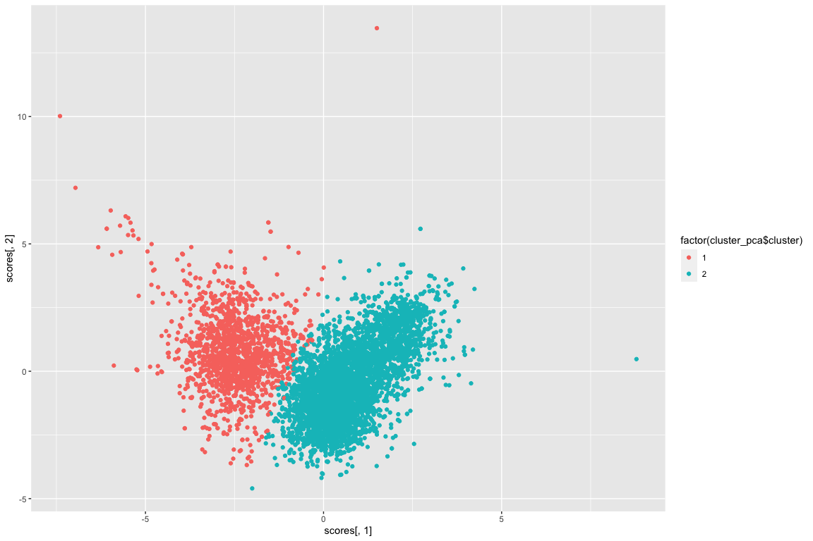

    ##        cluster
    ## color    red white
    ##   red   1575    24
    ##   white   82  4816

    ## [1] 0.9836848

#### Inference :

-   The clustering performed by using the scores from three principal
    components was very effective. The accuracy level was 98.3 percent.
    However, PCA is not as simple as k-means. I formed the clusters
    using the scores from the principal components. Because the accuracy
    of k-means is significantly greater and it is straightforward, I
    conclude that using the k-means technique for the supplied data
    makes more sense.

-   The quality of wine is rated on a scale of 1 to 10, but there are no
    ratings of 1, 2, or 10 in our data set. As a result, the wine in our
    data set was rated between 2 and 9, inclusive. I used k-means with
    k= 7 and 25 starts.

<!-- -->

    ## [1] 5 6 7 4 8 3 9

    ##             kmeans_cluster_2$cluster
    ## wine$quality   1   2   3   4   5   6   7
    ##            3   7   4   4   1   2   5   7
    ##            4  63  21  15   2  27  64  24
    ##            5 471  77 200  20 269 446 655
    ##            6 350 548 265   9 475 549 640
    ##            7  43 446 141   1 189 137 122
    ##            8   2  97  14   0  31  27  22
    ##            9   0   4   0   0   0   1   0

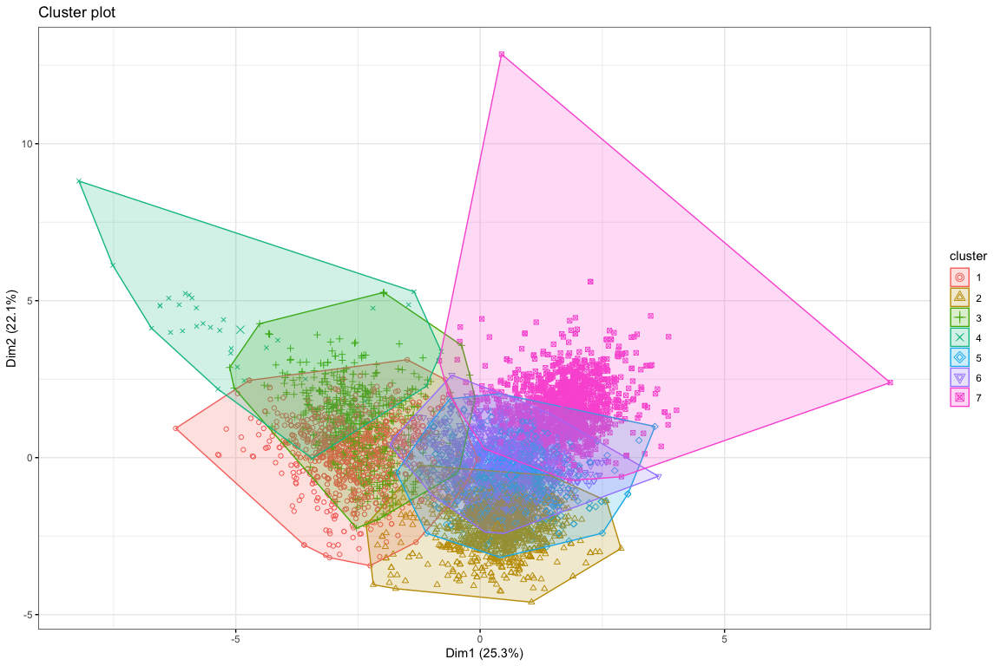

-   The confusion matrix shows that k-means clustering was unable to
    distinguish between different qualities of wine. For example, each
    cluster has a sizable number of wines rated 5, 6, and 7. There is no
    noticeable difference. Also looking at the clustered data we cannot
    come to a strong conclusion as there are overalapping clusters.

## Market segmentation

Objective : To create market segments based on the user interests and
identify the profiles of those segments

-   Explore the data for correlated interests  
-   Normalize the data and perform clustering  
-   Profile the clusters after k-means clustering

1.  4 columns(chatter,spam,adult,uncategorised) were removed

2.  Scaling was done on raw data

3.  Hierarchical clustering was performed on raw data and it was found
    the observations werenot entirely conclusive. The clusters also were
    not properly distinct.The objective of our experiment i.e
    segmentation was not being met properly So we decided to go a step
    ahead and do PCA on the raw data and then make it go through K-means
    custering to get improved clustering.

#### Explore the data for correlated interests

    ## 'data.frame':    7882 obs. of  37 variables:
    ##  $ X               : chr  "hmjoe4g3k" "clk1m5w8s" "jcsovtak3" "3oeb4hiln" ...
    ##  $ chatter         : int  2 3 6 1 5 6 1 5 6 5 ...
    ##  $ current_events  : int  0 3 3 5 2 4 2 3 2 2 ...
    ##  $ travel          : int  2 2 4 2 0 2 7 3 0 4 ...
    ##  $ photo_sharing   : int  2 1 3 2 6 7 1 6 1 4 ...
    ##  $ uncategorized   : int  2 1 1 0 1 0 0 1 0 0 ...
    ##  $ tv_film         : int  1 1 5 1 0 1 1 1 0 5 ...
    ##  $ sports_fandom   : int  1 4 0 0 0 1 1 1 0 9 ...
    ##  $ politics        : int  0 1 2 1 2 0 11 0 0 1 ...
    ##  $ food            : int  4 2 1 0 0 2 1 0 2 5 ...
    ##  $ family          : int  1 2 1 1 1 1 0 0 2 4 ...
    ##  $ home_and_garden : int  2 1 1 0 0 1 0 0 1 0 ...
    ##  $ music           : int  0 0 1 0 0 1 0 2 1 1 ...
    ##  $ news            : int  0 0 1 0 0 0 1 0 0 0 ...
    ##  $ online_gaming   : int  0 0 0 0 3 0 0 1 2 1 ...
    ##  $ shopping        : int  1 0 2 0 2 5 1 3 0 0 ...
    ##  $ health_nutrition: int  17 0 0 0 0 0 1 1 22 7 ...
    ##  $ college_uni     : int  0 0 0 1 4 0 1 0 1 4 ...
    ##  $ sports_playing  : int  2 1 0 0 0 0 1 0 0 1 ...
    ##  $ cooking         : int  5 0 2 0 1 0 1 10 5 4 ...
    ##  $ eco             : int  1 0 1 0 0 0 0 0 2 1 ...
    ##  $ computers       : int  1 0 0 0 1 1 1 1 1 2 ...
    ##  $ business        : int  0 1 0 1 0 1 3 0 1 0 ...
    ##  $ outdoors        : int  2 0 0 0 1 0 1 0 3 0 ...
    ##  $ crafts          : int  1 2 2 3 0 0 0 1 0 0 ...
    ##  $ automotive      : int  0 0 0 0 0 1 0 1 0 4 ...
    ##  $ art             : int  0 0 8 2 0 0 1 0 1 0 ...
    ##  $ religion        : int  1 0 0 0 0 0 1 0 0 13 ...
    ##  $ beauty          : int  0 0 1 1 0 0 0 5 5 1 ...
    ##  $ parenting       : int  1 0 0 0 0 0 0 1 0 3 ...
    ##  $ dating          : int  1 1 1 0 0 0 0 0 0 0 ...
    ##  $ school          : int  0 4 0 0 0 0 0 0 1 3 ...
    ##  $ personal_fitness: int  11 0 0 0 0 0 0 0 12 2 ...
    ##  $ fashion         : int  0 0 1 0 0 0 0 4 3 1 ...
    ##  $ small_business  : int  0 0 0 0 1 0 0 0 1 0 ...
    ##  $ spam            : int  0 0 0 0 0 0 0 0 0 0 ...
    ##  $ adult           : int  0 0 0 0 0 0 0 0 0 0 ...

    ##        User chatter current_events travel photo_sharing uncategorized
    ## 1 hmjoe4g3k       2              0      2             2             2
    ## 2 clk1m5w8s       3              3      2             1             1
    ## 3 jcsovtak3       6              3      4             3             1
    ## 4 3oeb4hiln       1              5      2             2             0
    ## 5 fd75x1vgk       5              2      0             6             1
    ## 6 h6nvj91yp       6              4      2             7             0

-   Each column represents an area of interest that a sample twitter
    follower would have tweeted about during the 7 day observation
    period.
-   Each cell in that column is the number of tweets that fell into that
    interest area.
-   We have about 7882 users with 36 areas of interest and one column
    for uncategorised.


**Findings:**

1.  The most tweets fall into the chatter category which doesn’t tell us
    a lot about the audience. However, we do see many tweets about
    health, cooking, gaming, photo sharing, fitness and university which
    sort of hints towards fitness , mostly young twitter following. We
    have to check if there exists a cluster of interests between the
    users.

2.  It is very clear that the tweet_count per variable is almost 8k

``` r
#Removing the labels from the data
#removing 4 not needed columns
analysis$chatter<- NULL
analysis$spam <- NULL
analysis$adult <- NULL
analysis$uncategorised <- NULL 
cormat <- cor(analysis[c(2:33)])
ggcorrplot(cormat,hc.order = TRUE,lab = TRUE)
```

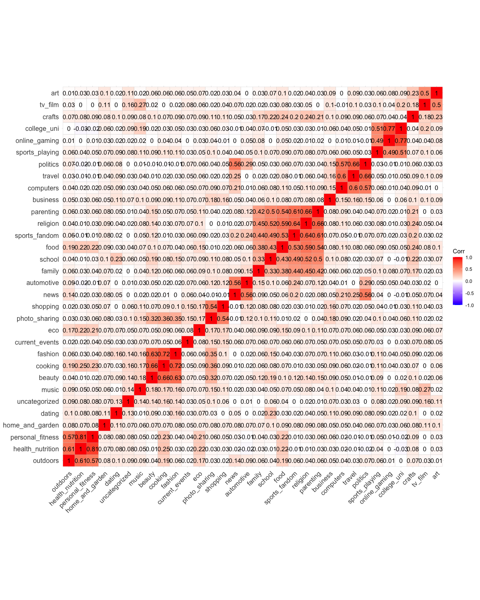

-   Shopping and photo-sharing are positively correlated  
-   College_uni and online_gaming stands out with a strong positive
    correlation  
-   Health_nutrition,peronal_fitness and outdoors have a high positive
    correlation showing these people are health conscious  
-   Fashion and beauty have a strong postive correlation

We can include all the variables in the cluster analysis to understand
if the same points appear after profiling the clusters

#### PCA

    ##        eigenvalue variance.percent cumulative.variance.percent
    ## Dim.1   4.3602296       14.0652569                    14.06526
    ## Dim.2   2.8022958        9.0396639                    23.10492
    ## Dim.3   2.5112081        8.1006711                    31.20559
    ## Dim.4   2.3260725        7.5034597                    38.70905
    ## Dim.5   2.1522085        6.9426080                    45.65166
    ## Dim.6   1.6184271        5.2207324                    50.87239
    ## Dim.7   1.4584385        4.7046402                    55.57703
    ## Dim.8   1.3772899        4.4428707                    60.01990
    ## Dim.9   1.1234567        3.6240538                    63.64396
    ## Dim.10  1.0097627        3.2572989                    66.90126
    ## Dim.11  0.9318664        3.0060206                    69.90728
    ## Dim.12  0.8788697        2.8350636                    72.74234
    ## Dim.13  0.8513936        2.7464309                    75.48877
    ## Dim.14  0.8056146        2.5987567                    78.08753
    ## Dim.15  0.7234314        2.3336497                    80.42118
    ## Dim.16  0.6546396        2.1117408                    82.53292
    ## Dim.17  0.5682773        1.8331524                    84.36607
    ## Dim.18  0.4837038        1.5603347                    85.92640
    ## Dim.19  0.4722343        1.5233363                    87.44974
    ## Dim.20  0.4276851        1.3796293                    88.82937
    ## Dim.21  0.4217956        1.3606310                    90.19000
    ## Dim.22  0.4083812        1.3173586                    91.50736
    ## Dim.23  0.3992588        1.2879315                    92.79529
    ## Dim.24  0.3808384        1.2285110                    94.02380
    ## Dim.25  0.3594740        1.1595936                    95.18340
    ## Dim.26  0.3532794        1.1396108                    96.32301
    ## Dim.27  0.3048934        0.9835270                    97.30653
    ## Dim.28  0.2360916        0.7615858                    98.06812
    ## Dim.29  0.2282973        0.7364428                    98.80456
    ## Dim.30  0.1923700        0.6205484                    99.42511
    ## Dim.31  0.1782155        0.5748888                   100.00000

``` r
fviz_eig(pca_sm)
```


-   Since we can clearly see from the above graph and the summary table
    for after 10 components the eigen value drops below 1 , hence
    according to Kaiser Rule we will consider 10 dimensions for PCA.

-   Now we take that data from the PCA with 10 dimensions we will look
    at K-Means Clustering

#### Normalize the data and perform k - means clustering

    ##  [1] 170791.17 148900.88 134564.49 122782.20 111990.18 101963.05  95104.83
    ##  [8]  88431.81  83294.97  79119.22  75889.24  72830.26  70609.42  68552.11
    ## [15]  67083.79

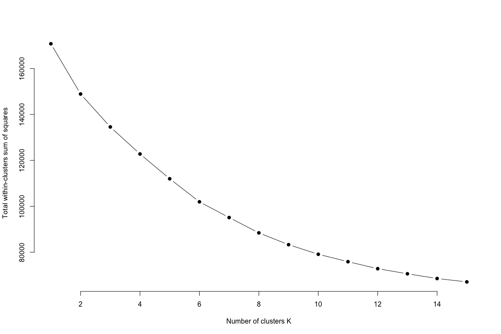

-   We can see that there is a clear bend at 6 on the graph for elbow,
    so lets go with 6 clusters for K means

**Cluster visualization**


The clusters look separated, as well as we can see many common points
between clusters.Let’s identify the characteristics of the clusters.

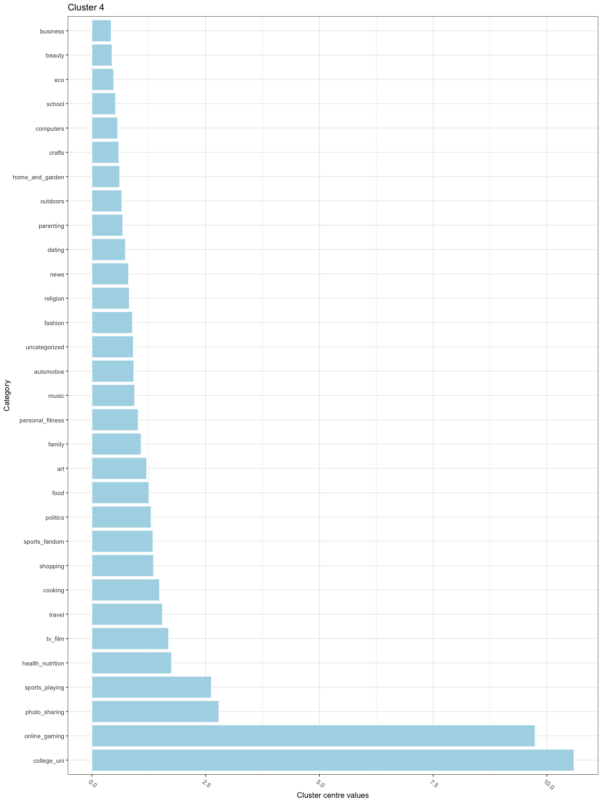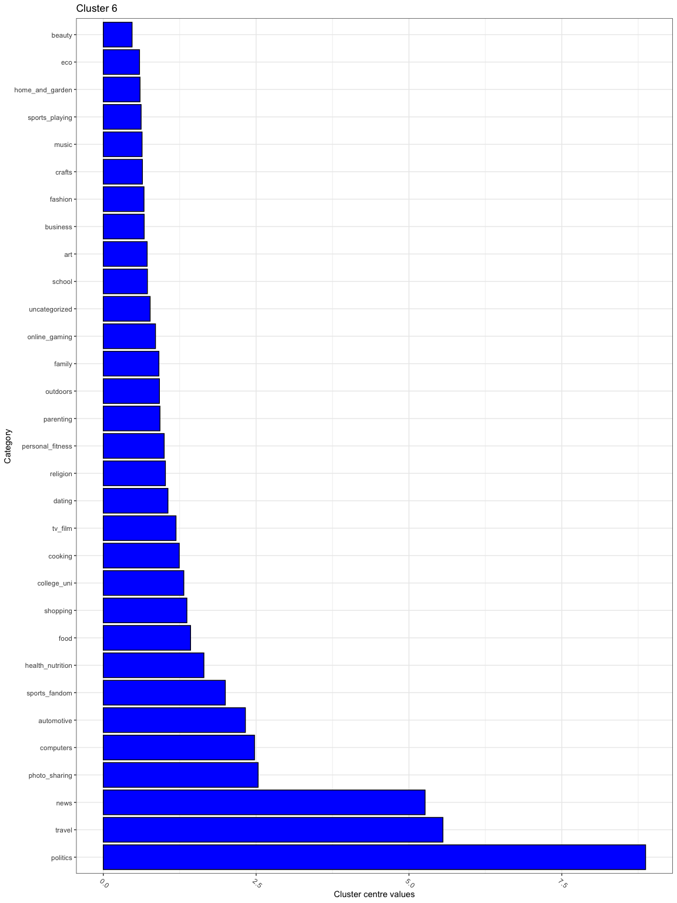

**Results**

-   There are multiple interesting profiles that came out of the
    clusters  

-   Cluster 1 - This Segment is full of people who are more focused on
    their diet/ are a more fitness oriented people as they tweet a lot
    about *health nutrition, Personal_fitness, cooking*

-   Cluster 2 - This Cluster of people talk about *photo_sharing,
    shopping and travel* which indicates that they are more into
    travel/exploring

-   Cluster 3 - People in this segment are into *Photo sharing, cooking
    and Fashion the most*, this cannot give us any string conclusion,
    but we can assume that these people are into social media stuff
    where they talk about sharing things

-   Cluster 4 - This cluster is full of university students as they talk
    about *college_uni, online_gaming,photo_sharing*

-   Cluster 5 - In this segment tweets are more about *sports_fandom,
    religion, food * again no concrete conlusion from this set of people
    but we can assume these are a group of people in a set who are a all
    of one religion and stay together

-   Cluster 6 - This segment is profoundly middle aged people as they
    talk more about *politics, travel, news*

## The Reuters corpus

#### Question:

We are trying to solve a author attribution problem in our use case, as
our data is relevant for this type of problem. Author attribution is the
task of identifying the author of a given document.

#### Approach:

The approach we used to solve this problem is as follows

**Data preprocessing :**

-   Step 1 - Read in the training text files from individual folders.

All the text files that will be used for training are stored in distinct
folders, each labeled with the author’s name. I created a function that
will extract all of these texts and save them in a dataframe.

-   Step 2 - Convert data to corpus

To perform any text analytics operation, we must first convert this to a
corpus and then to a Document-Term matrix. This includes removing
stopword, case conversion, removing special characters in end/begining,
basically cleaning the text so that it can be used in for analysis.

    ##    feature frequency rank docfreq group
    ## 1     said     19856    1    2482   all
    ## 2  percent      5211    2    1501   all
    ## 3  million      4838    3    1358   all
    ## 4     year      4277    4    1618   all
    ## 5      new      3513    5    1472   all
    ## 6   market      3219    6    1273   all
    ## 7  company      3208    7    1214   all
    ## 8  billion      3009    8    1058   all
    ## 9      one      2750    9    1440   all
    ## 10    also      2696   10    1545   all

We can see that the most used word across the train data are *said,
percent ,million, year*, this should give us an understanding on what
most data speaks about.

This concludes the data preparation step of the analysis. We do the same
on test data as well.

**PCA**

There are numerous features to choose from. Let’s utilize PCA to extract
the most significant variables from the 782 unique phrases stated above!

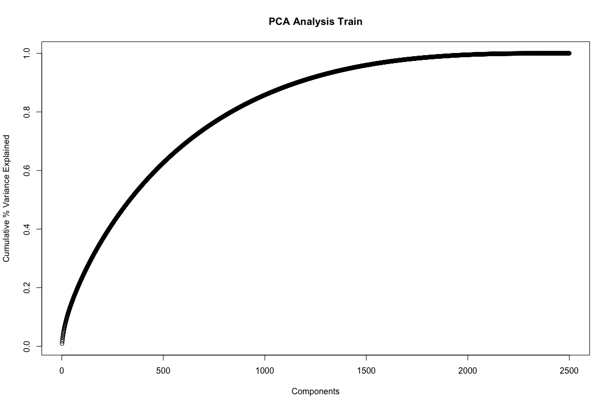

According to an overview of the variance described, 350 or so primary
components account for roughly 50% of the total variance.

1.  In the training dataset, we will now take the first 350 PC scores
    from the PCA analysis as predictors.

2.  Additionally, we want our testing results to be at the same scale as
    the train data. We will scale the test data and multiply it by the
    component loadings obtained!

**Model Training**

Now that we have created the training and testing matrices, let’s
convert them to dataframes ready for modelling!

*Model 1 - K-Nearest Neighbors*

It makes sense that documents closer to each other (using similar terms)
in terms of the Manhattan distance would be from the same author. Lets
try K-Nearest Neighbors to predict the author for each document in the
test set!

1.  We will use a K Nearest neighbor model and look for the best K-value
    in the range of 1-15.
2.  For the distance metric, we will use the Manhattan distance

``` r
# a vector to store the accuracies of the knn model
accuracies <- NULL

for (i in 1:15){
  knn_model <- kknn(training_class_labels ~ .,
                    X_train,
                    X_test_pc,
                    distance = 1,
                    k= i,
                    kernel = 'rectangular')
  
  accuracies <- c(accuracies,sum(knn_model$fitted.values == testting_class_labels)/length(testting_class_labels))
}

plot(c(1:15), accuracies, main = "KNN accuracy vs K", xlab = "K-Values", ylab = "Accuracy Score", lty = 1)
```


The plot shows that using 4 nearest neighbors, we get an overall
accuracy of \~35%.

-   Let us look at which author attribution did we get right and at what
    accuracy did we do it.

<!-- -->

    ## # A tibble: 5 × 2
    ##   Actual_Author   Accuracy
    ##   <fct>              <dbl>
    ## 1 TheresePoletti      0.9 
    ## 2 LynnleyBrowning     0.88
    ## 3 LynneO'Donnell      0.82
    ## 4 KirstinRidley       0.8 
    ## 5 JoWinterbottom      0.78

-   Let us look at which author attribution did we not get right and at
    what accuracy did we do it.

<!-- -->

    ## # A tibble: 5 × 2
    ##   Actual_Author  Accuracy
    ##   <fct>             <dbl>
    ## 1 AlexanderSmith     0.02
    ## 2 JaneMacartney      0.02
    ## 3 EdnaFernandes      0.04
    ## 4 KarlPenhaul        0.04
    ## 5 RogerFillion       0.04

*Model 2 - Random Forest*

The accuracy with K Nearest Neighbors isnt good! We don’t want to do
worse than a coin toss! Let’s try out the Random Forest models and check
if we do any better! <br>

1.  We will use a random forest model with 1000 trees with the default
    value of variables to pick for each tree!

<!-- -->

    ## [1] "Accuracy is 59.04"

The random Forest models give us 59.04% accuracy. This is much better
than the knn model with 35% accuracy.

-   Let us look at which author attribution did we get right and at what
    accuracy did we do it.

<!-- -->

    ## # A tibble: 5 × 2
    ##   Actual_Author   Accuracy
    ##   <fct>              <dbl>
    ## 1 JimGilchrist        1   
    ## 2 LynnleyBrowning     1   
    ## 3 KarlPenhaul         0.96
    ## 4 MatthewBunce        0.86
    ## 5 RobinSidel          0.86

-   Let us look at which author attribution did we not get right and at
    what accuracy did we do it.

<!-- -->

    ## # A tibble: 5 × 2
    ##   Actual_Author    Accuracy
    ##   <fct>               <dbl>
    ## 1 TanEeLyn             0.08
    ## 2 EdnaFernandes        0.12
    ## 3 ScottHillis          0.16
    ## 4 DarrenSchuettler     0.18
    ## 5 BenjaminKangLim      0.2

We see that accuricies are better than the knn model for both rightly
redictd and wrongly predicted data ! This is a good candidate for a
prediction model!

*XGBoost model*

Finally, let’s run the XGBoost model and check if it is able to improve
upon the accuracy of the random Forest model. We believe so because by
design XGBoost tries to capture the remaining pattern in the residuals
of each previous model.

``` r
# XGBoost model

train_data_xgboost_matrix <- data.matrix(X_train[,1:350])
test_data_xgboost_matrix <- data.matrix(X_test_pc)

dtrain <- xgb.DMatrix(data = train_data_xgboost_matrix, label = as.numeric(X_train[,351]) - 1)
dtest <- xgb.DMatrix(data = test_data_xgboost_matrix, label = as.numeric(as.factor(testting_class_labels)) - 1)

boost_model <- xgboost(data = dtrain, # the data   
                       nround = 100, # max number of boosting iterations
                       objective = "multi:softmax",
                       eta = 0.15,
                       num_class = 50,
                       max_depth = 7,
                       eval_metric = "mlogloss",
                       verbose = 0)

author_predict <- predict(boost_model, dtest)
accuracy <- mean(author_predict == (as.numeric(as.factor(testting_class_labels)) - 1))*100

print(paste0("Accuracy is ", accuracy))
```

    ## [1] "Accuracy is 53.84"

So, we get 53.84% accuracy with XGboost. This is not better than the
Random Forest model.

*Model 4 - Naive Bayes*

When it comes to identifying the author, Naive Bayes relies on the
presumption that each observed phrase is independent of the others! As a
result, we determine the likelihood of getting an author for each
observed phrase in the test document term matrix! This is repeated for
each term that is offered, and the result is the likelihood that an
author is the source of the document.

So we see that Naive Bayes achieves an accuracy of 62.32%.

-   Let us look at which author attribution did we get right and at what
    accuracy did we do it.

<!-- -->

    ## # A tibble: 5 × 2
    ##   Actual_Author   Accuracy
    ##   <chr>              <dbl>
    ## 1 JimGilchrist        1   
    ## 2 LynnleyBrowning     1   
    ## 3 FumikoFujisaki      0.96
    ## 4 KarlPenhaul         0.94
    ## 5 AaronPressman       0.92

### Conclusion

To solve the author attribution with the data we have is not an easy
task, but we achieved it with 62.32% accuracy using a Naive Bayes model.

In the process we also found out that the frequency of words in the
training and testing data are different, which could lead to an
assumption that the train and test data are of different context’s and
are non repetative.

In the process we also saw saw the % of accuricies for each model
predicting the right author.

We have made a few assumptions during our process of which i have two to
highlight we considered terms only that were 99% or more in frequency to
the enitre document and we limited our test data to the terms that were
there in the training data

## Assocition Rule Mining

    ## 'data.frame':    9835 obs. of  1 variable:
    ##  $ V1: chr  "citrus fruit,semi-finished bread,margarine,ready soups" "tropical fruit,yogurt,coffee" "whole milk" "pip fruit,yogurt,cream cheese ,meat spreads" ...

    ##       V1           
    ##  Length:9835       
    ##  Class :character  
    ##  Mode  :character


We transform the data into a “transactions” class before applying the
apriori algorithm in association rule mining.

The summary of the dataset reveals the following:

1.  There are total of 9835 transactions in our dataset

2.  Whole milk is the present in 2513 baskets and is the most frequently
    bought item

3.  More than half of the transactions have 4 or lesser items per basket

4.  Considering only unique items in each basket so that we do not get
    skewed results after applying the apriori mining algorithm

<!-- -->

    ## Apriori
    ## 
    ## Parameter specification:
    ##  confidence minval smax arem  aval originalSupport maxtime support minlen
    ##         0.5    0.1    1 none FALSE            TRUE       5   0.001      1
    ##  maxlen target  ext
    ##      10  rules TRUE
    ## 
    ## Algorithmic control:
    ##  filter tree heap memopt load sort verbose
    ##     0.1 TRUE TRUE  FALSE TRUE    2    TRUE
    ## 
    ## Absolute minimum support count: 9 
    ## 
    ## set item appearances ...[0 item(s)] done [0.00s].
    ## set transactions ...[169 item(s), 9835 transaction(s)] done [0.00s].
    ## sorting and recoding items ... [157 item(s)] done [0.00s].
    ## creating transaction tree ... done [0.00s].
    ## checking subsets of size 1 2 3 4 5 6 done [0.01s].
    ## writing ... [5668 rule(s)] done [0.00s].
    ## creating S4 object  ... done [0.00s].

    ## set of 10 rules

    ## Available control parameters (with default values):
    ## layout    =  stress
    ## circular  =  FALSE
    ## ggraphdots    =  NULL
    ## edges     =  <environment>
    ## nodes     =  <environment>
    ## nodetext  =  <environment>
    ## colors    =  c("#EE0000FF", "#EEEEEEFF")
    ## engine    =  ggplot2
    ## max   =  100
    ## verbose   =  FALSE

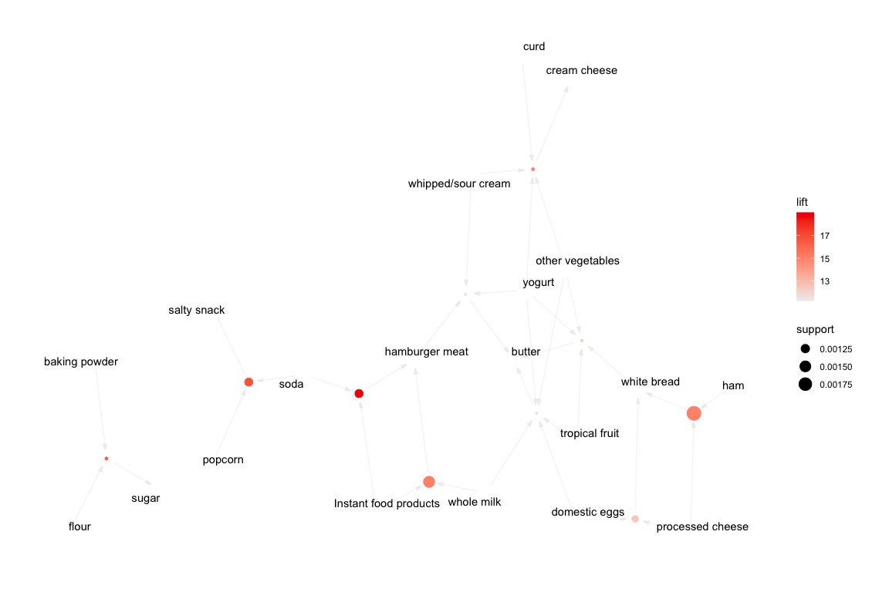

**Conclusion**

A study of the associations shows us the following

1.  People purchase soda, popcorn and other salty snacks together.

2.  Cheese, ham, white bread and eggs usually sell together.

3.  Sugar, baking powder and flour sell together, these are usually
    baking items.

4.  Cheese, curd, whipped cream and yogurt sell together!

## References

1.  We have referred Stack overflow for the issues/errors/syntax while
    coding - <https://stackoverflow.com/>

2.  Professor James Scott class slides -
    <https://github.com/Vishu611/STA380-Part2-JamesProffclass/tree/master/slides>

3.  R site official documentation -
    <https://www.r-project.org/other-docs.html>

<!-- <!-- <!-- ### Approach 2 -->
<!-- * support > 0.05, confidence > 0.1 and length <= 2 using the 'apriori' algorithm -->
<!-- ```{r echo=FALSE, include=FALSE} -->
<!-- grocrules_1 = apriori(item_transactions,  -->
<!--                      parameter=list(support=0.05, confidence=.1, minlen=2)) -->
<!-- ``` -->
<!-- There are only 6 rules generated because of the high support and low confidence level. We also notice that most relationships in this item set include whole milk, yogurt and rolls/buns which is in accordance with the transaction frequency plot we saw earlier. These are some of the most frequently bought items. -->
<!-- ```{r echo=FALSE} -->
<!-- arules::inspect(grocrules_1) -->
<!-- plot(grocrules_1, method='graph') -->
<!-- ``` -->
<!-- * support > 0.02, confidence > 0.2 and length <= 2 -->
<!-- ```{r echo=FALSE, include=FALSE} -->
<!-- grocrules_2 = apriori(item_transactions,  -->
<!--                      parameter=list(support=0.02, confidence=.2, minlen=2)) -->
<!-- arules::inspect(grocrules_2) -->
<!-- ``` -->
<!-- * This item set contains 72 rules and includes a lot more items. However, whole milk still seems to be a common occurence. -->
<!-- ```{r echo=FALSE} -->
<!-- plot(head(grocrules_2,15,by='lift'), method='graph') -->
<!-- ``` -->
<!-- * support > 0.0015, confidence > 0.8 and length <= 2 -->
<!-- ```{r echo=FALSE, include=FALSE} -->
<!-- grocrules_3 = apriori(item_transactions,  -->
<!--                      parameter=list(support=0.0015, confidence=0.8, minlen=2)) -->
<!-- arules::inspect(grocrules_3) -->
<!-- ``` -->
<!-- ```{r echo=FALSE} -->
<!-- plot(head(grocrules_3, 5, by='lift'), method='graph') -->
<!-- ``` -->
<!-- ### Conclusion -->
<!-- From the association rules, some of the conclusions that can be drawn are: -->
<!-- 1. People are more likely to buy bottled beer if they purchased red wine or liquor -->
<!-- 2. People are more likely to buy vegetables when they buy vegetable/fruit juice -->
<!-- 3. Whole milk is the most common item purchased by customers -->
